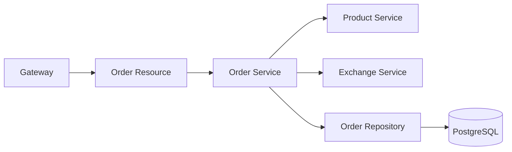

# Order Architecture

## Persistencia

O Flyway cria o schema `orders` com as tabelas:

- `orders.orders`;
- `orders.order_items`.

## Chamadas entre servicos

O `order-service` usa OpenFeign para chamar:

- `product-service`, durante a criacao do pedido;
- `exchange-service`, quando o cliente solicita conversao de moeda.

## Propagacao de identidade

O header `id-account` representa a conta autenticada e e usado para criar, listar e consultar pedidos apenas do usuario correto.
