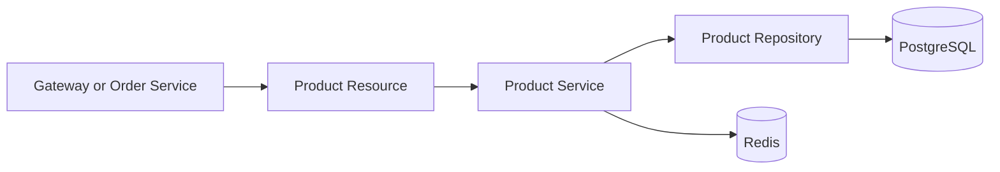

# Product Architecture

## Persistencia

O Flyway cria o schema `products` e a tabela `products.products`. O Hibernate valida o schema no startup em vez de criar tabelas automaticamente.

## Cache

O Redis reduz pressoes de leitura em consultas repetidas:

- `GET /products`;
- `GET /products/{id}`.

## Observabilidade

O Spring Actuator expoe:

- `/actuator/health`;
- `/actuator/prometheus`.
