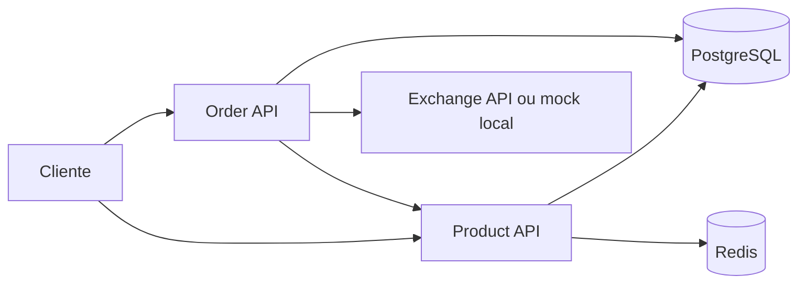

# Arquitetura

## Product API

Responsavel por persistir e consultar produtos. Usa PostgreSQL como banco principal e Redis para cache.

## Order API

Responsavel por persistir pedidos e calcular totais. Para criar pedidos, consulta a Product API. Para converter moeda, consulta a Exchange API.

## Banco de dados

Os dois servicos usam o mesmo PostgreSQL local, mas com schemas separados:

- `products`
- `orders`

As tabelas sao criadas por migrations Flyway.

